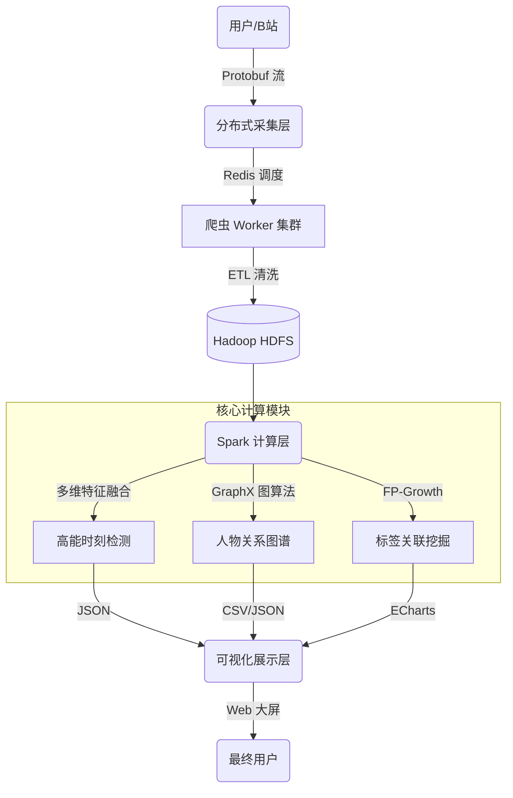

# 基于 Hadoop+Spark 的 B站番剧弹幕大数据挖掘与可视分析
[](LICENSE)
[](https://www.python.org/)
[](https://spark.apache.org/)
[](https://hadoop.apache.org/)
[](https://echarts.apache.org/)

---

## 📖 项目简介 (Introduction)

本项目是一个针对 Bilibili 热门番剧（如《间谍过家家》、《凡人修仙传》）的端到端大数据分析系统。针对弹幕数据量大、非结构化、接口加密等挑战，我们构建了“分布式采集 - HDFS 存储 - Spark 并行计算 - Web 可视化”的全链路架构。

系统包含四大核心子系统：
1.  **🕷️ 分布式爬虫系统**：基于 Protobuf 协议逆向，突破接口限制，实现毫秒级全量采集。
2.  **🔥 高能时刻检测系统**：首创“密度+情感+交互”三维融合算法，精准定位剧情高潮。
3.  **🕸️ 人物关系图谱系统**：利用 GraphX 图计算挖掘角色共现网络。
4.  **🏷️ 标签关联挖掘系统**：基于 FP-Growth 算法挖掘番剧题材的隐含关联规则。

---

## 🏗️ 系统架构 (Architecture)




---

## 📂 模块导航 (Modules)

本项目采用模块化设计，每个子目录均包含独立的功能实现与详细文档：

| **目录**              | **模块名称**     | **核心技术**                    | **说明文档**                                                 |
| --------------------- | ---------------- | ------------------------------- | ------------------------------------------------------------ |
| **`crawler/`**        | **分布式采集**   | Protobuf 逆向, Redis, Requests  | [查看文档](https://www.google.com/search?q=crawler/README.md) |
| **`hot/`**            | **高能时刻检测** | Spark SQL, NLP, 自适应阈值算法  | [查看文档](https://www.google.com/search?q=hot/README.md)    |
| **`relation_graph/`** | **人物关系图谱** | Spark GraphX, PageRank, Louvain | [查看文档](https://www.google.com/search?q=relation_graph/README.md) |
| **`tag/`**            | **标签关联挖掘** | FP-Growth, 关联规则挖掘         | [查看文档](https://www.google.com/search?q=tag/README.md)    |
| **`data/`**           | **数据集**       | CSV, HDFS, 词频统计结果         | [查看文档](https://www.google.com/search?q=data/README.md)   |

------

## 🚀 快速开始 (Quick Start)

### 1. 环境依赖

- **基础环境**: Python 3.8+, Java 8
- **大数据组件**: Hadoop 3.x, Spark 3.x (On YARN/Local)
- **中间件**: Redis (用于爬虫任务队列)

### 2. 安装 Python 库

在项目根目录下运行：

```
pip install -r crawler/requirements.txt
pip install -r tag/requirements.txt
# 核心依赖: pyspark, redis, protobuf, jieba, pyecharts
```

### 3. 一键运行流程

#### 第一步：数据采集 (Crawler)

```
# 1. 启动 Redis
# 2. 发布任务
python crawler/task_producer.py
# 3. 启动 Worker (支持多开)
python crawler/spider_worker.py
```

#### 第二步：高能时刻分析 (Hot Module)

```
# 提交 Spark 任务计算高能时刻
spark-submit --master local[*] hot/spark_energy.py

# 启动可视化服务
cd hot && python -m http.server 8000
# 访问: http://localhost:8000/visualize.html
```

#### 第三步：人物关系挖掘 (Relation Graph)

```
# 提交 Spark 图计算任务
spark-submit --master local[*] relation_graph/danmaku_analysis_cluster.py

# 生成图谱可视化
python relation_graph/visualize_graph.py
# 查看生成的 html 文件
```

#### 第四步：标签关联分析 (Tag Mining)

```
# 运行关联规则挖掘
cd tag && python main.py
```